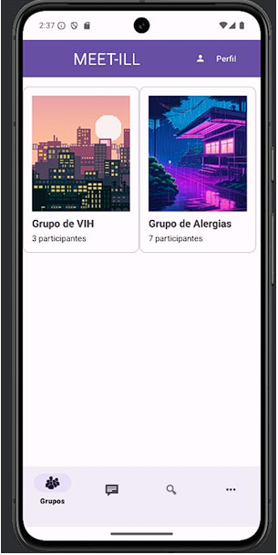

#  📱 MEET-ILL 💉

## Tecnologías utilizadas:

Se desarrolló la aplicación usando por IDE Android Studio y la aplicación fue programada en Kotlin y aprovechando servicios de FireBase

## Nombre del proyecto: 
Meet-ill

## Colaboradores: 
    
    - Javier Monteserín Rodríguez (El montapuercos)
    
    - Mikel González Rodríguez. (Mickelodeon)
    
## Descripción general: 
Meet-ill consiste en una aplicación móvil para poner en contacto a diferentes personas con patologías similares.

El primer prototipo mostraría algo tal que así:

Y acabo resultando en algo como esto la ventana inicial de la aplicación:

