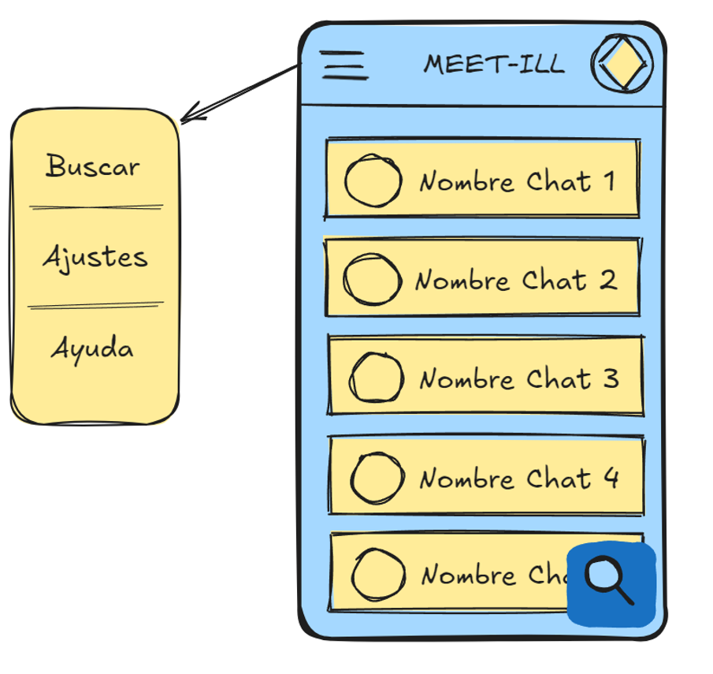

#  📱 MEET-ILL 💉

Nombre del proyecto: Meet-ill

Colaboradores: 

    - Pedro Castro Montes. uo288120
    
    - Javier Monteserín Rodríguez. uo288524
    
    - Mikel González Rodríguez. uo289630
    
Descripción general: Meet-ill consiste en una aplicación móvil para poner en contacto a diferentes personas con patologías similares.

El primer prototipo mostraría algo tal que así:

